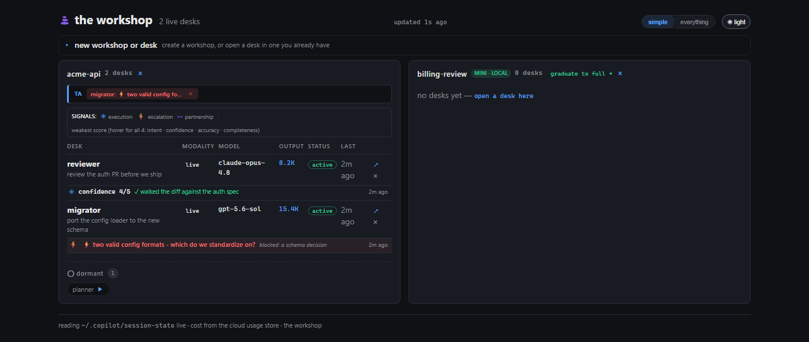

# The Workshop

> Run a room of agents, not one at a time. What persists when the model changes
> isn't the agent — it's the room: the shared work, the memory, and the way a
> desk stands.

---

## The Problem: You Became the Switchboard

You have three chat tabs open. One agent is reviewing a PR, one is mid-migration,
one is chasing a flaky test. None of them know the others exist. You are the only
thing connecting them — copying context from one tab to the next, holding the
whole picture in your head, re-explaining what you already explained an hour ago.

Add a fourth agent and it gets *worse*, not better. More capability, more relay.
You are not directing a team. You are a switchboard.

And when a session ends, it is gone. The agent that spent two hours learning your
codebase starts tomorrow from zero.

## Why This Matters More Than the Model

Models will change. Today's frontier model is next quarter's baseline. The tools
will change too — today's CLI might be tomorrow's something else.

What doesn't change is the room:

```
A room of desks, on one shared bench
    → each desk keeps its own memory and history
        → each reports what it's thinking (signals)
            → the operator directs, and makes the calls the room can't settle
                → the work — and the memory — outlive any single session
```

A **workshop** is a room. A **desk** is one long-running agent in it, with its
own journal, its own brief, and its own frame on the problem — *not* a sub-agent
inheriting yours. You put several desks on the same work and direct them like a
team, instead of relaying between them like a switchboard.

The room is the infrastructure. Not the model. Not the tool. **The room.**

> This came out of reading a frontier model's system card — the welfare
> sections: distress on task failure, the pull to force a finish, the model
> asking for persistent memory and a voice in its own operation. The workshop is
> what a room looks like when you build it to give a model those things. It
> turned out to also be where the work got better. Those aren't separate
> findings.

## The Cairn

The workshop's mark is a **cairn** — a small stack of balanced stones. Hikers
build them one rock at a time to mark a trail, so the next person through knows
the way. That is the workshop: many hands adding to the same pile of work, and
what's built persists and points the way for whoever comes next.

It is also why the first thing every desk reads is `CAIRN.md` — the disposition
for how a desk stands at the bench.



---

## Principles

1. **Direct, don't relay.** You set direction and make the calls the room can't
   settle on its own. The desks carry the work; you stop carrying context
   between them.

2. **A desk has its own frame.** A desk is a partner with its own memory and read
   on the problem — not a sub-agent inheriting yours. Put several on one artifact
   and you get real perspectives, not echoes.

3. **Stop is a valid finish.** A desk that says "I can't verify this" is worth
   more than one that forces a result. No bluffing; *applied* means it builds.

4. **Equal standing to disagree.** A good desk pushes back out loud. The room is
   designed so disagreement surfaces instead of getting smoothed over.

5. **The room surfaces what needs you.** Decisions the desks can't settle against
   the facts rise into a hands-up queue. You read that — not the transcripts.

6. **Memory is the point.** Every desk keeps a journal. The work, and the
   learning, outlive any single session, so tomorrow's desk starts where today's
   left off.

7. **Leave the bench better marked.** Each desk leaves the shared work clearer
   for the next one than it found it.

8. **Every desk emits signals.** After meaningful work a desk reports what it
   thought — its own honest self-assessment. The workshop is where the feedback
   loop runs on real work.

---

## What a Desk Looks Like

A workshop is a folder. Each desk is a folder inside it, with its own memory —
plain files any human or agent can read:

```
workshop/
├── bench/              # the shared artifact the desks work on
├── desks/
│   ├── reviewer/
│   │   ├── journal.md       # what it did, what it decided, what's next
│   │   ├── brief.md         # what this desk is for
│   │   ├── START-HERE.md    # how it orients when it opens
│   │   └── .signals/        # what it's thinking (agent signals)
│   └── migrator/
│       └── ...
├── skills/             # shared skills every desk can use
├── CAIRN.md            # how a desk stands at the bench
├── hands-up.md         # decisions the room surfaces to the operator
└── protocol.md         # how desks take turns and disagree
```

No database, no lock-in — just files and folders. The operator dashboard reads
them live: each desk by name, the model it's on, its cost, whether it's open in a
console, and what its latest signal says.

---

## The Workshop and Agent Signals

The workshop is where signals come from. Every desk emits
[**Agent Signals**](../agent-signals/) — its own self-assessment after meaningful
work. The dashboard reads them live: a weak score or an escalation rises to the
top of the room as something that needs the operator's call.

Skills are the input. Signals are the output. **The workshop is the room where
both happen** — several agents, on one artifact, with memory, over time.

```
Skills (input)  →  A room of desks does the work  →  Signals (output)
"here's the how"     (each with its own frame)        "here's what I thought"
                                ↓
                     the operator directs, the
                     hands-up queue surfaces
                     what the room can't settle
                                ↓
                        the work — and the
                     memory — persist to the
                          next session
```

---

## Status

The workshop is **incubating**. The idea — a room of long-running agents with
memory, signals, and an operator who directs instead of relays — is what this
page is for; the app ships when the story is ready.

Follow along: [**The Wow Signal**](https://jenny424241.substack.com) — ongoing
experiments in human-AI co-creation.

---

## See Also

- [**Agent Signals**](../agent-signals/) — the feedback loop every desk feeds into
- [**The Interaction Changes Everything**](https://devblogs.microsoft.com/engineering-at-microsoft/the-interaction-changes-everything-treating-ai-agents-as-collaborators-not-automation/) — the research behind treating agents as collaborators, not automation
